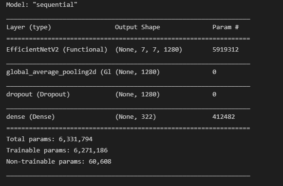
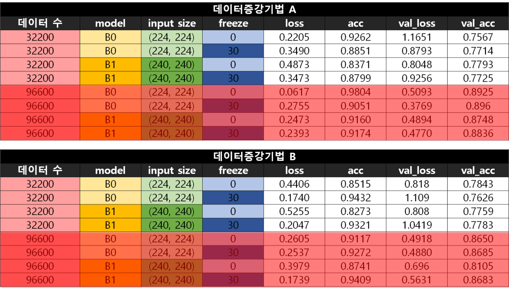
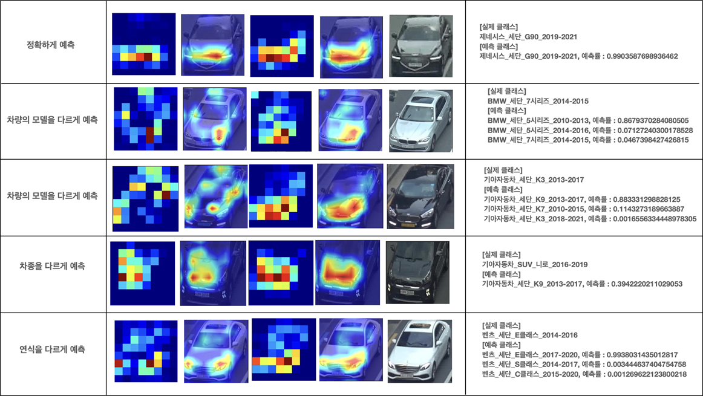

# NEXTLab Car Detection Project
코드스테이츠 기업협업 프로젝트로 ‘NEXTLab’ 회사와 협업하여 CCTV 영상에서 차량을 인식하고, 차종을 분류하는 모델을 만들었습니다.

참여자  
A 팀 : 김홍균, 이재웅, 신정태  
B 팀 : 황산하, 조미래, 박정기

## 구조
````Python
NEXTLab-CNN-EfficientNet
┖ core
  ┖ config.py               # Configuration.
  ┖ utils.py                # Util 함수.

┖ 
  EfficientNet.ipynb        # 전체 코드 주피터 노트북 버전. 경로 수정 필요.
  launcher_augument.py      # 이미지 증강 실행.
  launcher_classname.py     # 이미지 클래스(레이블) 생성 실행.
  main.py                   # EfficientNetv2 학습.
  models.py                 # EfficientNetv2 모델 코드.
  test.py                   # 학습된 모델 테스트 코드.
readme.md
````

## 프로젝트 가설
사람의 자동차 전면부를 보고 모델과 연식을 구분하는 기준은 자동차 모델별 특징인 그릴, 헤드라이트, 범퍼와 같은 특징입니다.

CNN 기반의 EfficientNet는 차량 전면부 이미지를 통해 사람의 판단 기준과 같이 판단할 지, 오분류를 한다면 어떤 부분이 문제인지 검증할 필요를 느꼈습니다.


### 프로젝트 목표

- 차량 이미지 데이터로 학습한 EfficientNet model을 통해 영상 또는 이미지 속 차량을 차종, 연식 등으로 구분
- 사람의 판단 기준과 같은지 파악하기 위한 HeatMap으로 가설 검증
- CNN 모델 검증

## 데이터 설명
### Train/Validatation Data
- AI 허브의 "자동차 차종/연식/번호판 인식용 영상" 사용: <a href="https://aihub.or.kr/aidata/27727"> https://aihub.or.kr/aidata/27727 </a>
- "세단", "SUB", "해치백", "승합" 중 322개의 클래스만을 사용.
- 데이터 불균형 해소를 위해 클래스 당 100, 300장의 이미지가 되도록 이미지 증강 사용.  

### Test Data
- NEXTLab에서 제공한 도로 CCTV 영상 : https://www.nextlab.ai/
- 80개의 클래스로 이루어진 5016개의 영상 (비공개)

## Model Structure
</a>
- EfficientNetB0 모델 사용.

## Model evaluation
<div>

</div>


두 팀이 나눠서 진행하였으며 학습 데이터가 많을 수록 학습이 잘 되고, 일반화가 잘되는 모습을 볼 수 있습니다.(붉은색 부분)

Augmentation 기법 A: 김홍균, 이재웅, 신정태  
Augmentation 기법 B: 조미래, 황산하, 박정기

## Best Model Parameter  
- 모든 class(322종)에 대해 이미지 데이터 300개씩 증강한 데이터(96600장)
- EfficientV2 B0
- input size(224,224,3)
- input 30 layer freeze (학습규제)
- imagenet pretrained 가중치 사용

## Test Data Result


## 문제점 및 개선사항
- Resize하기 전의 차량 이미지 정보를 받아 비슷한 차량 모델의 크기를 비교해 구분 ex) K3, K7  
- 전수 검사를 통해 클래스(레이블) 오분류 수정

## 활용 방안 및 향후 과제
- 주차장 마다 제한 높이 및 주차장 규격이 상이합니다. 주변 지역을 자주 통행하는 자동차 종류를 파악하여 공유 주차장 플랫폼을 이용하기 위한 고객의 차종을 예측하고, 차종별 적절한 주차장 추천 모델에 적용할 수 있습니다.  
  
- 객체검출 오픈소스인 YOLO를 이용하여 실시간 교통 CCTV 영상으로 Object Detecion 학습을 진행할 계획입니다.
